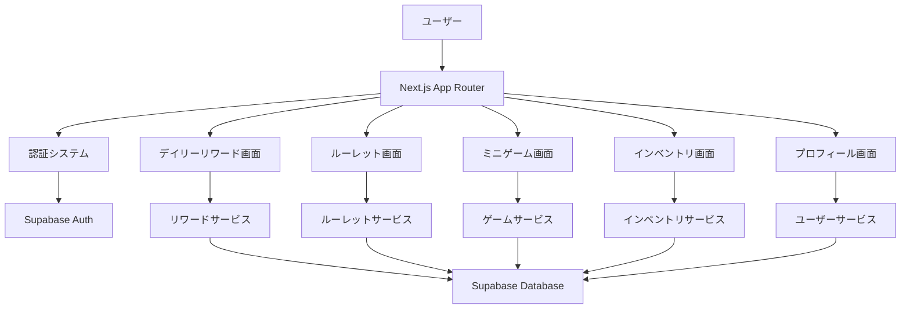

# デザイン文書

## 概要

デイリーリワードシステムは、Next.js 15 App Router、TypeScript、Tailwind CSS v4、shadcn/ui、Supabase、Drizzleを活用したRPG風のWebアプリケーションです。ユーザーの継続的なエンゲージメントを促進するため、ゲーミフィケーション要素を取り入れた魅力的なUIと、毎日のログインを促すリワードメカニズムを提供します。

## アーキテクチャ

### 技術スタック統合

- **フロントエンド**: Next.js 15 App Router + TypeScript + Tailwind CSS v4
- **UIコンポーネント**: shadcn/ui + Radix UI primitives
- **バックエンド**: Supabase (認証・データベース・リアルタイム機能)
- **ORM**: Drizzle ORM
- **状態管理**: React Server Components + Client Components の適切な分離
- **アニメーション**: Tailwind CSS + CSS transitions
- **音響効果**: Web Audio API

### システム構成



## コンポーネントとインターフェース

### ページ構成

#### 1. デイリーリワードダッシュボード (`/daily-rewards`)
- **目的**: メインハブとして全機能へのアクセスポイント
- **コンポーネント**: `DailyRewardsDashboard`
- **機能**:
  - 今日の進捗状況表示
  - ルーレット・ミニゲームへのナビゲーション
  - 連続ログイン日数表示
  - 獲得可能な特典のプレビュー

#### 2. ルーレily-rewards/roulette`)
- **目的**: ランダム特典獲得のゲーミフィケーション
- **コンポーネント**: `RouletteGame`
- **機能**:
  - 3Dライクなルーレット回転アニメーション
  - 特典アイテムの視覚的表示
  - 結果発表エフェクト
  - 実行済み状態の管理

#### 3. ミニゲーム画面 (`/daily-rewards/mini-game`)
- **目的**: スキルベースの特典獲得システム
- **コンポーネント**: `MiniGame`
- **機能**:
  - シンプルなクリックゲーム（反応速度測定）
  - スコア表示とランキング
  - 難易度調整機能
  - ハイスコア記録

#### 4. インベントリ画面 (`/daily-rewards/inventory`)
- **目的**: 獲得特典の管理と使用
- **コンポーネント**: `Inventory`
- **機能**:
  - グリッドレイアウトでのアイテム表示
  - アイテム詳細モーダル
  - 使用・削除機能
  - カテゴリ別フィルタリング

#### 5. プロフィール画面 (`/daily-rewards/profile`)
- **目的**: ユーザーの進捗と実績表示
- **コンポーネント**: `UserProfile`
- **機能**:
  - レベル・経験値表示
  - 実績バッジシステム
  - 統計情報（総ログイン日数、獲得特典数等）
  - プログレスバーとビジュアライゼーション

### 共有コンポーネント

#### UI Components (`src/components/shared/`)

1. **`RPGCard`**: RPG風のカードデザイン
   - グラデーション背景
   - 光沢エフェクト
   - ホバーアニメーション

2. **`ProgressBar`**: 経験値・進捗表示
   - アニメーション付きプログレス
   - カスタムカラーテーマ
   - パーセンテージ表示

3. **`RewardItem`**: 特典アイテム表示
   - レアリティ別カラーリング
   - アイコン・名前・説明
   - 獲得エフェクト

4. **`GameButton`**: RPG風ボタン
   - 3Dライクなデザイン
   - プレス・ホバーエフェクト
   - 無効化状態のスタイリング

5. **`NotificationToast`**: 特典獲得通知
   - アニメーション付きトースト
   - アイコン・メッセージ・効果音
   - 自動消去機能

### レイアウトシステム

#### レスポンシブデザイン
- **モバイル**: 縦スクロール、タッチ最適化
- **タブレット**: 2カラムレイアウト
- **デスクトップ**: 3カラムレイアウト、サイドバーナビゲーション

#### ダークテーマRPG風デザイン
- **基調色**: 深い紫・青のグラデーション
- **アクセント**: 金色・オレンジ（特典・レア要素）
- **背景**: 星空・魔法陣パターン
- **フォント**: Geist Mono（既存）+ ファンタジー風見出し

## データモデル

### データベーススキーマ拡張

```sql
-- ユーザーの日次活動記録
CREATE TABLE daily_activities (
    id UUID PRIMARY KEY DEFAULT gen_random_uuid(),
    user_id UUID REFERENCES users(id) ON DELETE CASCADE,
    activity_date DATE NOT NULL,
    login_count INTEGER DEFAULT 1,
    roulette_completed BOOLEAN DEFAULT FALSE,
    mini_game_completed BOOLEAN DEFAULT FALSE,
    mini_game_score INTEGER DEFAULT 0,
    created_at TIMESTAMP WITH TIME ZONE DEFAULT NOW(),
    updated_at TIMESTAMP WITH TIME ZONE DEFAULT NOW(),
    UNIQUE(user_id, activity_date)
);

-- ユーザーの連続ログイン記録
CREATE TABLE login_streaks (
    id UUID PRIMARY KEY DEFAULT gen_random_uuid(),
    user_id UUID REFERENCES users(id) ON DELETE CASCADE UNIQUE,
    current_streak INTEGER DEFAULT 0,
    longest_streak INTEGER DEFAULT 0,
    last_login_date DATE,
    total_login_days INTEGER DEFAULT 0,
    created_at TIMESTAMP WITH TIME ZONE DEFAULT NOW(),
    updated_at TIMESTAMP WITH TIME ZONE DEFAULT NOW()
);

-- 特典アイテムマスター
CREATE TABLE reward_items (
    id UUID PRIMARY KEY DEFAULT gen_random_uuid(),
    name TEXT NOT NULL,
    description TEXT,
    rarity TEXT CHECK (rarity IN ('common', 'rare', 'epic', 'legendary')) DEFAULT 'common',
    icon_url TEXT,
    item_type TEXT CHECK (item_type IN ('coin', 'gem', 'boost', 'cosmetic')) DEFAULT 'coin',
    value INTEGER DEFAULT 1,
    is_active BOOLEAN DEFAULT TRUE,
    created_at TIMESTAMP WITH TIME ZONE DEFAULT NOW()
);

-- ユーザーのインベントリ
CREATE TABLE user_inventory (
    id UUID PRIMARY KEY DEFAULT gen_random_uuid(),
    user_id UUID REFERENCES users(id) ON DELETE CASCADE,
    reward_item_id UUID REFERENCES reward_items(id) ON DELETE CASCADE,
    quantity INTEGER DEFAULT 1,
    acquired_at TIMESTAMP WITH TIME ZONE DEFAULT NOW(),
    used_at TIMESTAMP WITH TIME ZONE,
    is_used BOOLEAN DEFAULT FALSE
);

-- ユーザーレベル・経験値
CREATE TABLE user_levels (
    id UUID PRIMARY KEY DEFAULT gen_random_uuid(),
    user_id UUID REFERENCES users(id) ON DELETE CASCADE UNIQUE,
    current_level INTEGER DEFAULT 1,
    current_exp INTEGER DEFAULT 0,
    total_exp INTEGER DEFAULT 0,
    created_at TIMESTAMP WITH TIME ZONE DEFAULT NOW(),
    updated_at TIMESTAMP WITH TIME ZONE DEFAULT NOW()
);

-- 実績システム
CREATE TABLE achievements (
    id UUID PRIMARY KEY DEFAULT gen_random_uuid(),
    name TEXT NOT NULL,
    description TEXT,
    icon_url TEXT,
    condition_type TEXT NOT NULL, -- 'login_streak', 'total_logins', 'roulette_wins', etc.
    condition_value INTEGER NOT NULL,
    reward_exp INTEGER DEFAULT 0,
    is_active BOOLEAN DEFAULT TRUE,
    created_at TIMESTAMP WITH TIME ZONE DEFAULT NOW()
);

-- ユーザー実績達成記録
CREATE TABLE user_achievements (
    id UUID PRIMARY KEY DEFAULT gen_random_uuid(),
    user_id UUID REFERENCES users(id) ON DELETE CASCADE,
    achievement_id UUID REFERENCES achievements(id) ON DELETE CASCADE,
    achieved_at TIMESTAMP WITH TIME ZONE DEFAULT NOW(),
    UNIQUE(user_id, achievement_id)
);
```

### Entity定義

#### `DailyActivity`
```typescript
type DailyActivity = {
  id: string;
  userId: string;
  activityDate: string; // YYYY-MM-DD
  loginCount: number;
  rouletteCompleted: boolean;
  miniGameCompleted: boolean;
  miniGameScore: number;
  createdAt: Date;
  updatedAt: Date;
};
```

#### `LoginStreak`
```typescript
type LoginStreak = {
  id: string;
  userId: string;
  currentStreak: number;
  longestStreak: number;
  lastLoginDate: string | null;
  totalLoginDays: number;
  createdAt: Date;
  updatedAt: Date;
};
```

#### `RewardItem`
```typescript
type RewardItem = {
  id: string;
  name: string;
  description: string | null;
  rarity: 'common' | 'rare' | 'epic' | 'legendary';
  iconUrl: string | null;
  itemType: 'coin' | 'gem' | 'boost' | 'cosmetic';
  value: number;
  isActive: boolean;
  createdAt: Date;
};
```

#### `UserInventory`
```typescript
type UserInventory = {
  id: string;
  userId: string;
  rewardItemId: string;
  quantity: number;
  acquiredAt: Date;
  usedAt: Date | null;
  isUsed: boolean;
};
```

## エラーハンドリング

### エラー分類と対応

#### 1. ネットワークエラー
- **対応**: 自動リトライ機能（最大3回）
- **UI**: ローディングスピナー + エラートースト
- **ログ**: Supabase Functions でのエラーログ記録

#### 2. 認証エラー
- **対応**: 自動ログイン画面リダイレクト
- **UI**: 認証状態の明確な表示
- **セキュリティ**: セッション期限の適切な管理

#### 3. データ整合性エラー
- **対応**: トランザクション処理での巻き戻し
- **UI**: ユーザーフレンドリーなエラーメッセージ
- **復旧**: 自動データ修復機能

#### 4. ゲームロジックエラー
- **対応**: 安全な初期状態への復帰
- **UI**: 再試行ボタンの提供
- **ログ**: 詳細なデバッグ情報の記録

### エラー境界設定
```typescript
// 各ページレベルでのエラー境界
// ゲーム機能の部分的な障害でもアプリ全体が停止しないよう設計
```

## テスト戦略

### テスト分類

#### 1. 単体テスト (Vitest)
- **対象**: ビジネスロジック関数、ユーティリティ関数
- **重点**: ルーレット抽選ロジック、経験値計算、レベルアップ判定
- **カバレッジ**: 90%以上

#### 2. コンポーネントテスト (Testing Library)
- **対象**: UI コンポーネントの表示・操作
- **重点**: ゲーム状態の表示、ボタンの有効/無効状態
- **カバレッジ**: 主要コンポーネント100%

#### 3. 統合テスト
- **対象**: API連携、データベース操作
- **重点**: 特典付与フロー、連続ログイン計算
- **環境**: テスト用Supabaseプロジェクト

#### 4. E2Eテスト (将来実装)
- **対象**: ユーザージャーニー全体
- **重点**: ログイン→ゲーム→特典獲得の一連の流れ

### テストデータ管理
- **モックデータ**: 開発環境での一貫したテストデータ
- **シードデータ**: 特典アイテム、実績データの初期投入
- **テスト用ユーザー**: 各種状態のテストユーザー作成

## パフォーマンス最適化

### フロントエンド最適化

#### 1. コード分割
- **ページレベル**: 各ゲーム画面の遅延読み込み
- **コンポーネントレベル**: 重いアニメーションコンポーネントの動的インポート

#### 2. 画像最適化
- **Next.js Image**: 特典アイコン、背景画像の最適化
- **WebP対応**: 軽量画像フォーマットの活用
- **遅延読み込み**: インベントリ画面での画像遅延読み込み

#### 3. アニメーション最適化
- **CSS Transform**: GPU加速の活用
- **Intersection Observer**: 画面外要素のアニメーション停止
- **requestAnimationFrame**: 滑らかなアニメーション実装

### バックエンド最適化

#### 1. データベースクエリ最適化
- **インデックス**: 頻繁なクエリへの適切なインデックス設定
- **N+1問題**: JOINクエリでの一括取得
- **キャッシュ**: Supabase Edge Functions でのレスポンスキャッシュ

#### 2. リアルタイム機能
- **Supabase Realtime**: 特典獲得の即座反映
- **接続管理**: 不要な接続の適切な切断

## セキュリティ考慮事項

### データ保護
- **Row Level Security**: Supabaseでのユーザーデータ保護
- **入力検証**: Zodスキーマでの厳密な入力検証
- **SQLインジェクション**: Drizzle ORMでの安全なクエリ実行

### ゲーム整合性
- **サーバーサイド検証**: 特典付与の二重チェック
- **レート制限**: API呼び出しの頻度制限
- **不正操作防止**: クライアントサイドでの改ざん対策

### 認証・認可
- **JWT検証**: Supabase Authでの適切なトークン管理
- **セッション管理**: 適切な有効期限設定
- **権限制御**: ユーザー固有データへのアクセス制限

## 運用・監視

### ログ管理
- **アプリケーションログ**: Supabase Functions でのログ集約
- **エラー追跡**: 詳細なスタックトレース記録
- **ユーザー行動ログ**: ゲーム利用状況の分析

### メトリクス監視
- **パフォーマンス**: ページ読み込み時間、API応答時間
- **ユーザーエンゲージメント**: DAU、継続率、ゲーム参加率
- **エラー率**: 各機能のエラー発生頻度

### アラート設定
- **システム障害**: 重要機能の停止検知
- **パフォーマンス劣化**: 応答時間の異常検知
- **セキュリティ**: 不正アクセスの検知
